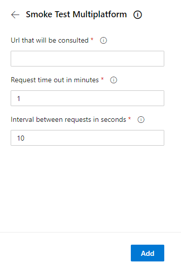

## SmokeTestMultiplatform
Azure devops extension that makes a simple smoke test using windows or linux agents.

## Getting started

1. From the Pipeline, search from **Smoke Test Multiplatform** task

